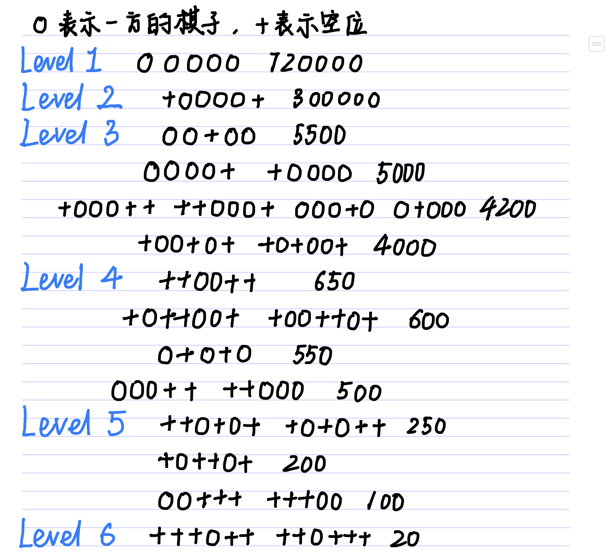

# 第三方平台
我的五子棋代码是在别人写的一个平台上实验的，这个平台每次将棋盘的信息放进标准输入流，平台自带判断游戏是否结束和落子位是否有子的功能，我只需每次输出一个坐标。

# 算法思路
1. evalue 估值函数 
  参考网上的估值表制订了一张估值表 
  

2. 深度优先搜索 
  value(位置x) = value(x引起的改变) - value(敌方下一步能引起的最大改变) 
  value(x引起的改变) = value(x落子后的局势) - value(x处落子前的局势) 
  在当前AI能走的所有位置x中，选择value(x)最大的位置x 
  目前我只能搜到两层，第三层勉强能跑出来，但下了几步之后AI就无法在10秒内落子了，第四层跑不出来 
  目前没有想到好的优化方法，这是一个值得改进的方向，之后试试能不能优化争取跑到第四层

3. 算杀 
  目前只能算五子连珠，活四和活三*2目前还没有加上去

# 实验结果
无论是AI先手还是我先手，我都没赢过（主要是因为我菜），我先手的时候输的更快，我也不知道为什么~~我这么菜~~ 
找朋友玩了一下，AI先手，10局AI输了2局

ps：压缩文件是Clion工程直接打包的，解压后可以直接跑
