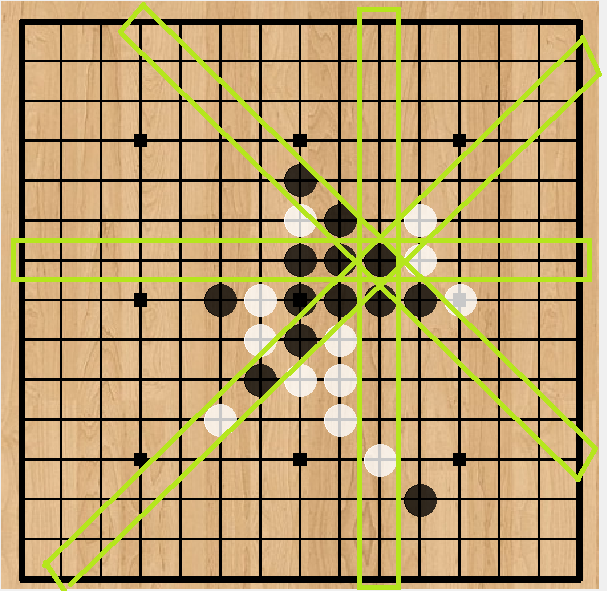
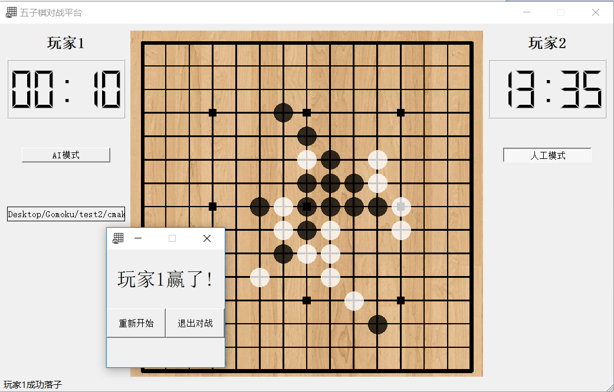

# 实验目的
编程设计一个五子棋AI

# 功能需求
1. AI 能够正常落子
2. 在保证实现第一条的前提下，尽可能地提升AI的棋力

# 总体设计
## 模块划分
1. 输入<br>
  第三方平台通过标准输入，输入到AI
2. 计算
3. 输出<br>
  通过标准输出，输出到第三方平台

## 基本数据结构
1. 局面表达方式<br>
  根据估值表对各种棋型进行估值
2. 博弈树表达方式<br>
  深度搜索<br>
  ps：我并没有写经典的博弈树，但我确实在深度搜索的过程中模拟了博弈的过程

## 核心算法思路
1. 估值算法<br>
  只考虑一个落子对棋盘的改变<br>
  
  <br>如图，只需计算横、纵、斜四排落子前与落子后棋型的值的差值
2. 深度搜索<br>
  value(位置x) = evaluate(位置x) - max_value(下一步敌方走子)
3. 算杀<br>
  若预测到五子连珠的情况：
  1. 第一层就出现这种情况：直接返回，输出
  2. 非第一层出现：返回上一层，跳过~~（假设敌方不傻）~~

# 代码实现
## 估值算法
```C
board[point->x][point->y] = turn;   // 落子
point->value = point->value + evaluate(point, turn);
board[point->x][point->y] = turn;   // 收子
point->value = point->value - evaluate(point, turn);
```
## 深度搜索算法
```C
DPT *head = select_point();

DPT *dp(DPT *head, int turn, int height){
  while(head != NULL){
    if(height > 1){
      DPT *new_head = select_point();
      head->value = head->value - dp(new_head, next_turn, height-1);
    }
    head = head->next;
  }
  return max_head;
}
```

# 实验结果
1. ~~我被虐的截图~~在第三方平台上运行的截图<br>
  
2. 棋力水平<br>
  不太清楚<br>
  没有找很会玩的朋友帮忙测，我自己下无论先后手我都输，让一个朋友下AI后手AI胜率80%
3. 运行速度<br>
  给AI限制的时间是10秒，深度搜索一层和两层时，AI都可以在1秒内落子，但一层时棋力很弱；深度搜索三层时，前面几步AI可以在10秒内落子，后来就超时了；深度搜索四层，AI完全跑不动<br>
  本次实验代码的测试都是将深度搜索层数设为2时测试的

# 参考网站的链接
1. https://blog.csdn.net/lihongxun945/article/details/50730231
2. https://www.cnblogs.com/maxuewei2/p/4825520.html
3. https://kimlongli.github.io/2016/12/14/%E5%A6%82%E4%BD%95%E8%AE%BE%E8%AE%A1%E4%B8%80%E4%B8%AA%E8%BF%98%E5%8F%AF%E4%BB%A5%E7%9A%84%E4%BA%94%E5%AD%90%E6%A3%8BAI/
